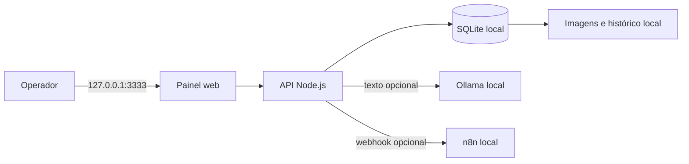

# 3D Master Automation

[](https://github.com/Felipekarpischin/3d-master-automation/actions/workflows/ci.yml)


Sistema local para transformar contatos de clientes em pedidos, orçamentos e etapas de produção de impressão 3D. O projeto combina uma interface administrativa simples, cálculo determinístico de custos, IA local e automação - sem API paga e sem enviar dados da operação para a nuvem.

> Projeto de portfólio com foco em automação, integração de sistemas, segurança local-first e aplicação prática de IA.

## O problema

Pequenas operações de impressão 3D costumam receber pedidos por vários canais e controlar preço, prazo e produção manualmente. Isso dificulta a padronização dos orçamentos e aumenta o risco de perder informações importantes.

## A solução

O 3D Master Automation centraliza o fluxo em uma única aplicação:

1. registra cliente, produto, quantidade, peso, tempo, prazo e referência visual;
2. calcula material, máquina, energia, extras e margem;
3. salva o histórico localmente em SQLite;
4. prepara uma mensagem comercial para WhatsApp;
5. aprimora o texto com Ollama, quando disponível;
6. notifica um workflow local do n8n;
7. acompanha o pedido até a entrega.

## Arquitetura



Todos os serviços operacionais usam o endereço de loopback `127.0.0.1`. O iniciador não cria túnel, não altera o roteador e não abre porta pública no computador.

Mais detalhes: [documentação de arquitetura](docs/ARCHITECTURE.md).

## Funcionalidades

| Área | Entrega |
|---|---|
| Pedidos | Cadastro, busca, imagem de referência e acompanhamento |
| Clientes | Criação automática e histórico de pedidos |
| Precificação | Material, máquina, energia, extras, margem e pedido mínimo |
| Produção | Status do pedido até entrega ou cancelamento |
| Comunicação | Mensagem pronta para copiar no WhatsApp |
| IA local | Aprimoramento opcional do texto com Ollama |
| Automação | Webhook local e workflow exportável do n8n |
| Persistência | SQLite e uploads armazenados somente no computador |

## Tecnologias e decisões

- **Node.js 22:** servidor HTTP e API usando apenas recursos nativos.
- **SQLite:** banco leve, transacional e simples de copiar para backup.
- **HTML, CSS e JavaScript:** interface responsiva sem framework pesado.
- **Ollama:** IA opcional executada localmente, sem cobrança por requisição.
- **n8n Community:** automação local e workflow versionado no repositório.
- **Node Test Runner:** testes de cálculo, fallback de mensagem e integração com SQLite.
- **GitHub Actions:** testes automáticos a cada push e pull request.

## Como executar

### Pré-requisitos

- Windows 10 ou 11;
- Node.js `22.13.0` ou superior;
- Ollama e n8n são opcionais para o funcionamento básico.

### Inicialização simples no Windows

Dê dois cliques em:

```text
INICIAR-3D-MASTER.cmd
```

O iniciador verifica os serviços locais e abre o painel em:

```text
http://127.0.0.1:3333
```

Mantenha a janela do iniciador aberta e pressione `Ctrl+C` para encerrar os processos iniciados por ela.

### Somente o painel

```powershell
npm start
```

### Desenvolvimento

```powershell
npm run dev
```

## IA local com Ollama

O sistema sempre possui uma mensagem padrão e continua funcionando sem IA. Para habilitar o aprimoramento de texto:

```powershell
ollama pull qwen3.5:4b
```

Depois, confirme no painel:

- endereço: `http://127.0.0.1:11434`;
- modelo: `qwen3.5:4b`.

## Automação com n8n

O workflow versionado está em [`n8n/workflows/3d-master-novo-pedido.json`](n8n/workflows/3d-master-novo-pedido.json). O webhook local padrão é:

```text
http://127.0.0.1:5678/webhook/3d-master-pedido
```

O workflow é publicado sem credenciais e permanece inativo no arquivo exportado. Se o n8n estiver desligado, os pedidos continuam sendo salvos normalmente.

## Testes

```powershell
npm test
```

A suíte verifica:

- formação do preço e margem;
- valor mínimo do pedido;
- mensagem de fallback sem IA;
- criação e leitura de pedido em SQLite.

## Segurança e privacidade

- painel e n8n limitados a `127.0.0.1`;
- nenhum Cloudflare Tunnel ou encaminhamento de porta no iniciador;
- banco, imagens, dados do n8n, arquivos `.env`, chaves e temporários bloqueados pelo `.gitignore`;
- nenhum dado real de cliente ou credencial versionado;
- acesso externo não suportado nesta versão sem autenticação, HTTPS e nova auditoria.

Veja a [política de segurança](SECURITY.md) para os limites e cuidados de implantação.

## Manual de operação

O passo a passo completo está disponível em:

**[Baixar o Manual Prático da 3D Master](outputs/Manual-Pratico-3D-Master.pdf)**

O PDF cobre inicialização, custos, pedidos, orçamento, WhatsApp, produção, n8n, backup e solução de problemas.

## Estrutura do projeto

```text
3d-master-automation/
|-- public/                 # Interface web
|-- lib/                    # Regras de precificação e mensagens
|-- n8n/workflows/          # Workflow exportável, sem credenciais
|-- scripts/                # Inicializador dos serviços locais
|-- tests/                  # Testes unitários e de integração
|-- docs/                   # Documentação técnica
|-- outputs/                # Manual público em PDF
|-- server.mjs              # Servidor, API e persistência SQLite
`-- INICIAR-3D-MASTER.cmd   # Inicialização simplificada no Windows
```

As pastas `data/`, `work/`, `tmp/` e `node_modules/` são locais e não são publicadas.

## Competências demonstradas

- levantamento de requisitos e transformação de processo manual em produto;
- modelagem de dados e persistência transacional;
- desenvolvimento full stack com JavaScript;
- integração entre API, IA local e automação;
- desenho de fallback para dependências opcionais;
- testes automatizados, documentação e segurança por padrão.

## Roadmap

- perfis por impressora e material;
- ficha de produção e orçamento em PDF;
- histórico de alterações por pedido;
- exportação de indicadores operacionais;
- autenticação e controle de acesso para uma futura versão em rede.

---

Desenvolvido como solução real para a operação da **3D Master** e como demonstração prática de automação e inteligência artificial local.
